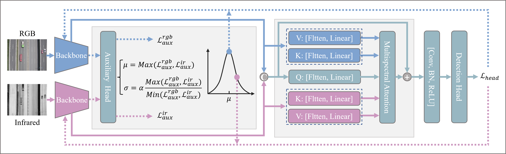

# [PRCV 2023] Modality Balancing Mechanism for RGB-Infrared Object Detection in Aerial Image

This is the official repository for “Modality Balancing Mechanism for RGB-Infrared Object Detection in Aerial Image” (PRCV2023). The repo is based on [AerialDetection](https://github.com/dingjiansw101/AerialDetection) and [mmdetection](https://github.com/open-mmlab/mmdetection).

## Abstract

RGB-Infrared object detection in aerial images has gained significant attention due to its effectiveness in mitigating the challenges posed by illumination restrictions. Existing methods often focus heavily on enhancing the fusion of two modalities while ignoring the optimization imbalance caused by inherent differences between modalities. In this work, we observe that there is an inconsistency between two modalities during joint training, and this hampers the model’s performance. Inspired by these findings, we argue that the focus of RGB-Infrared detection should be shifted to the optimization of two modalities, and further propose a Modality Balancing Mechanism (MBM) method for training the detection model. To be specific, we initially introduce an auxiliary detection head to inspect the training process of both modalities. Subsequently, the learning rates of the two backbones are dynamically adjusted using the Scaled Gaussian Function (SGF). Furthermore, the Multi-modal Feature Hybrid Sampling Module (MHSM) is introduced to augment representation by combining complementary features extracted from both modalities. Benefiting from the design of the proposed mechanism, experimental results on DroneVehicle and LLVIP demonstrate that our approach achieves state-of-the-art performance.



## Dataset

> 1. [DroneVehicle](https://github.com/VisDrone/DroneVehicle) 
> 2. Annotation files in COCO format can be downloaded in the [link](https://pan.baidu.com/s/1J_uiqczFmlW0tfdllu4iZw?pwd=vdbt). (extracting code: **vdbt**)

## Requirements
- Ubuntu 18.04
- CUDA 10.0
- NCCL 2+
- GCC 4.9+
- PyTorch 1.1
- Python 3.7
- torchvision 0.3
- mmcv 0.4.3

## Installation

Please refer to [INSTALL.md](INSTALL.md) for installation.

## Getting Started

### Train with a single GPU. 
```shell
python tools/train.py configs/rgbt_det/rgbt_oriented_rcnn/rgbt_det.py
```

### Inference

```shell
python tools/test.py configs/rgbt_det/rgbt_oriented_rcnn/rgbt_det.py work_dirs/rgbt_det/${CHECKPOINT_FILE}
```

## Citation

Please cite this paper if you want to use it in your work.

```
@ARTICLE{cai2023rgbtdet,
  title={Modality Balancing Mechanism for RGB-Infrared Object Detection in Aerial Image},
  author={Cai, Weibo and Li, Zheng and Dong, Junhao and Lai, Jianhuang and Xie, Xiaohua},
  booktitle={Chinese Conference on Pattern Recognition and Computer Vision (PRCV)},
  pages={81--93},
  year={2023},
  organization={Springer}
}
```
